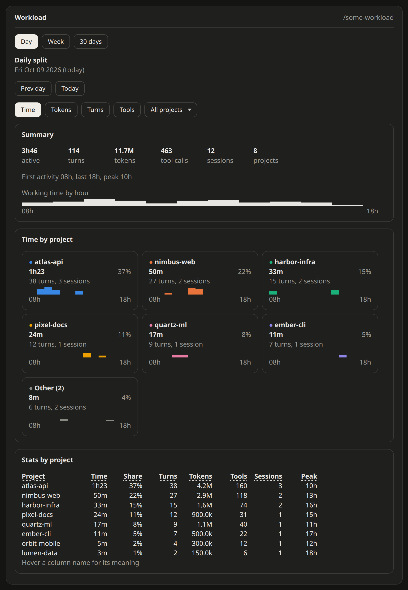

# workload

Tracks how much Claude works on each of your projects, across every session, and charts the load of a day, a week or 30 days in a pane.

| | |
| --- | --- |
| Use | `/some-workload` opens the pane |
| Records | Claude's working time per project and hour, turns, tokens, tool calls, sessions |
| Views | Daily, weekly and 30-day split, one card per project, by time, tokens, turns or tools |
| Changes Claude's behaviour | No, it only records and displays |
| Settings | `retentionDays`: days of history kept (120) |



## Behaviour

- Global: every session with the mod installed writes to the same history, whatever the project
- A project is the git repository's root folder name (worktrees count as their main repository), or the session folder's name outside git
- Recorded at the end of each turn, per project and per day:
  - Active time: how long Claude worked on the turn, split by hour of the day
  - Turns, tokens (input, output and cache, subagents included), tool calls, sessions
- `/some-workload` opens the pane

**Changes Claude's behaviour:** no. It only records and displays.

## Pane

Three modes, picked from the tab row at the top: **Daily split**, **Weekly split**, **30-day split**. The mode's title and period sit under the tabs, then three framed sections:

| Section | Content |
| --- | --- |
| Summary | Working time, turns, tokens, tool calls, sessions, projects, first, last and peak hour, and one bar line of the load over the period |
| By project | One card per project: value and share for the chosen metric, turns, sessions, and a bar line of its load |
| Stats by project | Every project with time, share, turns, tokens, tool calls, sessions, peak hour; hover a column name for its meaning |

- Bar lines run over the active hours in the daily split, over the days in the weekly and 30-day splits
- The 6 biggest projects get a colored card each; the rest share one gray "Other" card, and still have their own row in the stats table
- Plain text and colored blocks only, so the pane follows the light or dark theme in the desktop app and in the terminal

Controls (hotkeys work once the pane has focus):

| Control | Hotkey |
| --- | --- |
| Previous day or week, back to the current one | `h` / `t` |
| Next day or week, shown only on a past period | `l` |
| Daily, weekly, 30-day split | `d` / `w` / `m` |
| Metric: time, tokens, turns, tools | `1` / `2` / `3` / `4` |
| Show one project only | project picker |
| Back to all projects | "All projects" in the picker |

## Settings

| Setting | Type | Default | Description |
| --- | --- | --- | --- |
| `retentionDays` | number | `120` | Days of history kept; older days are deleted when a session starts |

Change it, then restart Claude Code:

```bash
echo '{"retentionDays":"365"}' | claude plugin configure workload@somelife-claude-mods --values-stdin
```

## Data

- Stored in the mod's own store under the Claude Code configuration directory, one entry per day
- Nothing leaves your machine
- Two sessions finishing a turn at the exact same moment can lose one of the two writes; the error is one turn at most
- Hours are in the local time of the machine
